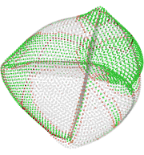
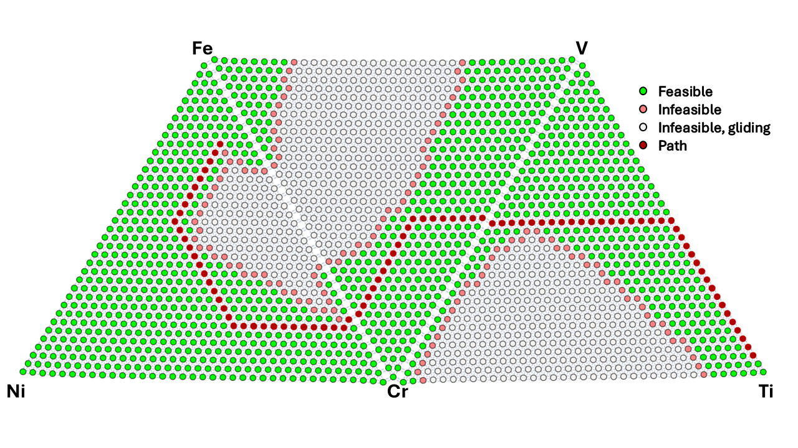

# AMMap

## `A`dditive `M`anufacturing `Map`ping of Compositional Spaces with Thermodynamic, Analytical, and Artificial Intelligence Models

<div align="left">
  
</div>

`AMMap` is a research-grade tool that utilizes our (a) new algorithm for representing complex compositional design spaces in AM as graphs, generated by high-performance [**`nimplex`**](https://github.com/amkrajewski/nimplex/tree/main) library discussed in our [*npj Unconventional Computing* paper (10.1038/s44335-024-00012-2)](https://doi.org/10.1038/s44335-024-00012-2), (b) established algorithms for optimal graph traversal, (c) thermodynamic models for phase stability and solidification, and (d) other scientific property models; in order to explore and navigate possible alloys which can be made, well beyond what can be visualized by humans, given constraints like using up to 4 feedstocks at the time out of 12 possibilities to choose from. Please refer to our recently-accepted [JPhysMat paper on AMMap itself (10.1088/2515-7639/ade73e)](https://doi.org/10.1088/2515-7639/ade73e) for full description.

Furthermore, `AMMap` generates reusable callables (with easy integration into AI pipelines) for several different CALPHAD based methods out-of-the-box and is set to grow rapidly in the near future. These include thermodynamic equilibrium calculations with [`pycalphad`](https://pycalphad.org), [Scheil-Gulliver solidification](https://en.wikipedia.org/wiki/Scheil_equation) with [`scheil`](https://github.com/pycalphad/scheil), and 5 different models for predicting cracking susceptibility discussed in [this publication](https://doi.org/10.1016/j.addma.2023.103672).

In the current "default" implementation, results coming from all these methods are used to **establish multi-constraint feasible subspace by exploring the `nimplex` graph representation of the design space without going into infeasible regions and find shortest/optimal paths between N desired alloys** using graph-based path planning tool of choice.

We have set up a cloud-based GitHub Codespace that can be used for all `Jupyter` notebook exercises for free with just a GitHub account. Your progress will be persisted for some time (depending on your settings) so it can be used for research activities too; however, the free version may lack the computational power to perform some heavier calculations (e.g., Scheil-Gulliver) fast; thus, we recommend that power users set it up locally or an HPC node, evaluating notebooks with a tool like `papermill`, in the background, or fetching pre-computed results (see [`scheilmap.json`](scheilmap.json)) from scripts to then be analysed in Codespaces.

**Quick Start**: [](https://codespaces.new/PhasesResearchLab/AMMap?quickstart=1)

## Capabilities
***Note*** Full technical discussions are given in our recent [JPhysMat paper (10.1088/2515-7639/ade73e)](https://doi.org/10.1088/2515-7639/ade73e). The section below provides short highlights of tool ability. 
1. **Simplex/Compositional Graph Generation** to allow for compositionally complex materials with high order of possible combinations to be fully considered in a homogenous fashion.
2. **Stitching of elemental spaces from different thermodynamic databases into singular traversable graph** to allow for path planning across multiple composition regions from incompatible databases due to model differences.
3. **Material Information Generation** Thermodynamic (Equilibrium and Scheil-Gulliver) information about the material at any given graph point calculated to determine phase composition to avoid undesired phase formation in path planning. Thermodynamic information can then be used to determine the hot-cracking susceptibility of a point to further inform material design. Visual representations of capabilities for example systems can be seen at end of README below.
4. **Infeasibility Gliding**: Detects infeasible regions and avoids unnecessary calculations of interior points to reduce total computational cost.
5. **Path Planning Compatibility** Deployment of any graph algorithms on created design space and highly compatible with backends of choice. Currently finds the shortest path which can be stretched. Found path can then be simplified to change from point-to-point path to generalized format.

- In **simple cases**, like path planning across 3 ternary spaces using on 3 different thermodynamic databases, to go from from approximated SS304L to pure titanium, the results generally look like this:

<div align="center">
  
</div>

- In **more advanced cases**, the results can no longer be visualized in 2D or 3D exactly, as graphs start to be hyperdimensional (5 and more components) or intersect each other, like in the example below from [our paper](https://doi.org/10.1088/2515-7639/ade73e). This, *in no way, affects the computation process, which can produce results for, e.g. all 6-components spaces in 12 component space given enough compute power,* but to visualize the results we have to rely on either (a) relaxed embeddings based on graph connectivity with some "energy" models,

<div align="center">
  
</div>

or unfolding the lower-dimensional (3/4 component) spaces of interest for analysis and planning,

<div align="center">
  
</div>

- See a couple of additional visualizations [in the Examples section](#example-outputs).

### Planned
1. **YAML format input** for human readable definition of design space, constraints, and objectives
2. **Expanded Property Models** More material properties that can be mapped onto compositional graphs are planned, e.g. elastic modulii
3. **Output of callables for Machine Learning**
4. **Path Planning Updates** to minimize the number of turns or more generally hyperplanes.
5. **Build Planning Algorithm** Collaboration to create algorithm to convert given path into physical AM build path for fabrication

## Installation

### Conda Environment and Installs
It is recommended to use new environements for all python projects, this can be done as follows:

```shell
conda create -n AMMAP python=3.11 liblapack jupyter numpy pandas plotly scikit-learn
```
```shell
conda activate AMMAP
```

Or, if your environment already exists, simply:
```shell
conda install -y python=3.11 liblapack jupyter numpy pandas plotly scikit-learn
```

### Clone repository
Clone the github repository in order to have the jupyter notebook and callables
```shell
git clone https://github.com/PhasesResearchLab/AMMap.git
```

### `nimplex`
The primary installation requirement is `nimplex`, which requires the small and easy-to-install [Nim](https://nim-lang.org/)
([Installation Instructions](https://nim-lang.org/install.html)) compiler (assuming you already have a `C` compiler), which can be done with a single command on most **Unix** (Linux/MacOS) systems:
- using [**conda**](https://docs.conda.io/en/latest/) cross-platform package manager:
  ```shell
  conda install -c conda-forge nim
  ```
- on **MacOS**, assuming you have [Homebrew](https://brew.sh/) installed:
  ```shell
  brew install nim
  ```
- with your Linux distribution's package manager (note that it may be an outdated `nim` version, impacting performance), for instance on Ubuntu/Debian **Linux**:
  ```shell
  apt-get install nim
  ```

Then, you can use the boundeled [Nimble](https://github.com/nim-lang/nimble) tool (`pip`-like package manager for Nim) to install two top-level dependencies: 
[`arraymancer`](https://github.com/mratsim/Arraymancer), which is a powerful N-dimensional array library, and [`nimpy`](https://github.com/yglukhov/nimpy) which 
helps with the Python bindings. You can do it with a single command:
```shell
nimble install -y arraymancer nimpy
```

Now, you can update the `nimplex` submodule repository and compile it for `AMMap`. You want to do so in a way that creates its **Python bindings**. You will need slightly different flags depending on your system configuration, but for Unix (Linux/MacOS) you can do so with commands below, after making sure you are in the root `AMMap` directory:
```shell
git submodule update --init --recursive
nim c --d:release --threads:on --app:lib --out:nimplex.so nimplex/src/nimplex.nim
nim c --d:release --threads:on --app:lib --out:utils/plotting.so nimplex/src/nimplex/utils/plotting.nim
```

For Windows and other platforms, you should consult [`nimpy`](https://github.com/yglukhov/nimpy) instructions.

### YAML Input Schema Parsing (*beta*)

AMMap supports **YAML format input** for human-readable definition of design spaces, constraints, and objectives. This feature enables users to configure complex multi-component alloy systems and their associated thermodynamic calculations through structured configuration files rather than programmatic setup.

#### Key Features

**Design Space Definition**: Define compositional spaces with elemental compositions, thermodynamic databases, and stitching relationships between different phase diagram regions.

**Constraint Specification**: Set up multiple types of constraints including:
- Equilibrium phase constraints (feasible, required, and infeasible phases)
- Scheil-Gulliver solidification parameters
- Liquid-to-crystal density limits
- Additive manufacturing cracking susceptibility criteria

**Path Planning Configuration**: Define start and end points for compositional path planning across the design space.

#### Example YAML Structure

YAML Example Documentation:

- **`name`**: (required, string) Unique identifier for the overall task at hand (e.g., transition between alloy systems).
- **`description`**: (optional, string) Short summary of the scenario or objective. Personal use only.
- **`nDivisionsPerDimension`**: (required, int) Number of subdivisions per compositional axis for discretizing the design space.

- **`constraints`**: (optional, list) List of rules applied during path planning.
  - **`type`**: (required, string) Constraint category (e.g., equilibrium, solidification, cracking).
  - For equilibrium phases:
    - **`temperature`**: (required, float/int) Temperature (K) for phase equilibrium evaluation; if step_temperature is not defined, will be a singular equilibrium result. Otherwise this is the maximum temperature for equilibrium simulations.
    - **`step_temperature`**: (optional, float/int) Temperature (K) by which to step by for creating a range of equilibrium results to investigate over.
    -**`min_temperature`**: (optional, float/int) Temperature (K) at which to cut off considerations for equilibrium feasibility. Default is 600 K.
    - **`pressure`**: (required, float/int) Pressure (atm or relevant units).
    - **`feasiblePhases`**: (optional, list[string]) Allowed phases present at the equilibrium; if any other phases are present, the point will be deemed infeasible.
    - **`infeasiblePhases`**: (optional, list[string]) Phases not allowed to be present at the equilibrium; any other phases will be allowed. TODO!
    - **`requiredPhases`**: (optional, list[string]) Phases that have to be present at the equilibrium for the point to be feasible; any other phases are allowed to be present as well unless added to `infeasiblePhases`. TODO!
  - For Scheil-Gulliver solidification:
    - **`startTemperature`**: (required, float/int) Starting temperature for simulation.
    - **`feasiblePhases`**: (optional, list[string]) Allowed phases present for feasibility; if other phases are present, the point will be deemed infeasible.
    - **`step_temperature`**: (required, float/int) Temperature (K) by which to step in Scheil-Gulliver simulation, down to point where no liquid phase exists
  - For AM cracking susceptibility:
    - **`criteria`**: (required, list[string]) Models or criteria for assessing cracking risk.

- **`elementalSpaces`**: (required, list) Defines available elemental composition spaces.
  - **`name`**: (required, string) Name of the elemental space.
  - **`elements`**: (required, list[string]) List of elements in the space.
  - **`tdb`**: (required, string) Associated thermodynamic database file.

- **`designSpaces`**: (required, list) Design spaces within each elemental space.
  - **`name`**: (required, string) Name of the design space.
  - **`elementalSpace`**: (required, string) Reference to the elemental space.
  - **`components`**: (required, list[list[float]]) List of compositions (fractions of each element) for key points (e.g., alloys, pure elements).

- **`pathPlan`**: (required, list) Sequence of steps or positions for path planning.
  - **`designSpace`**: (required, string) Name of the referenced design space.
  - **`position`** or **`index`**: (required, list[float] or list[int]) Location within the design space, as a composition vector (`position`) or index (`index`).

This structure allows users to define multi-step path planning problems for alloy design, including constraints, composition spaces, and the planned path.


```yaml
name: "StainlessSteel316L_to_Ti64"
description: "Path planning from SS316L to Ti-6Al-4V"
nDivisionsPerDimension: 12

constraints:
  - type: equilibrium
    temperature: 900
    pressure: 1
    feasiblePhases: [FCC_A1, BCC_A2, HCP_A3]
  - type: scheil
    startTemperature: 2500
  - type: AM cracking susceptibility
    criteria: [Kou, iCSC, sRDG, FR, CSC]

elementalSpaces:
  - name: SS_V
    elements: [Ni, Cr, Fe, V]
    tdb: Bobbio2021.tdb

designSpaces:
  - name: Ss_Cr_Ni
    elementalSpace: SS_V
    components:
      - [0.096, 0.200, 0.704, 0]  # SS316L composition
      - [0, 1, 0, 0]              # Pure Cr
      - [1, 0, 0, 0]              # Pure Ni

pathPlan:
  - designSpace: Ss_Cr_Ni
    position: [1, 0, 0, 0]
  - designSpace: Ti64_Cr_V
    index: [0, 1, 0, 0] 

```

#### Current Implementation Status

- ✅ **Basic YAML parsing** for design spaces and constraints
- ✅ **Constraint definition** for equilibrium and Scheil calculations
- ✅ **Path planning** start/end point specification
- 🔄 **Multi-database stitching** configuration
- 🔄 **Advanced constraint types** (elastic moduli, etc.)
- 🔄 **Comprehensive documentation** of all schema options

### CALPHAD Tools
When you are done, you should also install [pycalphad](https://pycalphad.org/docs/latest/) and a forked version of a python package for [`scheil`](https://github.com/pycalphad/scheil) found [here](https://github.com/HUISUN24/scheil)

```shell
pip install git+https://github.com/HUISUN24/scheil.git
pip install pycalphad
```

### Optional Pathfinding used in Example
```shell
pip install pqam-rmsadtandoc2023 pathfinding
```

### Other useful packages
To run `Jupyter` notebooks from the command line, especially useful on an HPC, you should install `papermill`:
```shell
pip install papermill
```

# Example Outputs 
## Equilibrium
<div align="center">
  

</div>

## Cracking Criteria
<div align="center">


</div>

## Path Planning with Infeasibility Gliding
<div align="center">


</div>

# Contributing Guidelines

`AMMap` is an MIT-licensed open-source project, and we welcome contributions from the community. As of June 2025, it is still a research-grade tool, but we are actively working on adding high-level of automation and other usable features to turn it into a user-tool that can be used by additive manufacturing researchers and engineers without significant programming experience. The goal is to have a simple `YAML`-based input format to describe the design space and constraints, and then the tool will run everything automatically on your machine or on an HPC.

If you are interested in contributing to the **core functionalities**, please reach out to us via [GitHub Issues](https://github.com/PhasesResearchLab/AMMap/issues) and we will be happy to discuss your ideas and help you get started.

If you are interested in contributing **scientific / ML / thermodynamic models** to our system, that can already be done in a relatively straightforward fashion, by providing a callable template script (see existing ones). Feel free to do a pull request directly but do not hesitate to reach out if you have any questions or need guidance.

# Please Cite

If you use `AMMap` in your research in any capacity, please cite the following two papers:

- Krajewski, A.M., Beese, A.M., Reinhart, W.F., *Efficient generation of grids and traversal graphs in compositional spaces towards exploration and path planning.* npj Unconv. Comput. 1, 12 (2024). DOI: https://doi.org/10.1038/s44335-024-00012-2

- Richter, A., Krajewski, A.M., Yang, Z., Beese, A.M., Liu, Z.K., *AMMap Tool for Additive Manufacturing Design, Alloy Discovery, and Path Planning*. Journal of Physics: Materials, Accepted (2025). DOI: https://doi.org/10.1088/2515-7639/ade73e

If you use the thermodynamic models through `pycalphad`, please also cite the following papers:

- Otis, R. & Liu, Z.-K., (2017). *pycalphad: CALPHAD-based Computational Thermodynamics in Python. Journal of Open Research Software*. 5(1), p.1. DOI: http://doi.org/10.5334/jors.140

If you use the cracking susceptibility models, please also cite the following paper:

- Yang Z., Sun H., Liu Z.-K., Beese A.M., *Design methodology for functionally graded materials: Framework for considering cracking*, Additive Manufacturing, Vol 73, 2023, 103672. DOI: https://doi.org/10.1016/j.addma.2023.103672